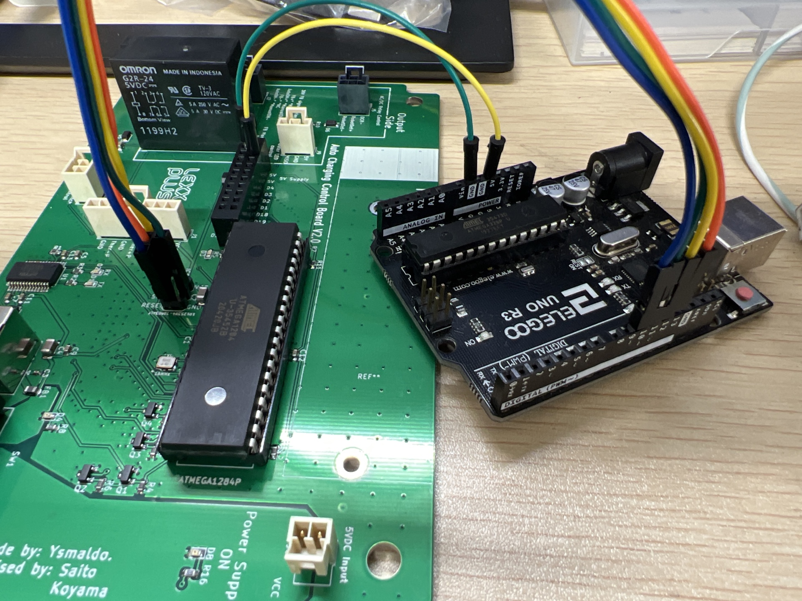

# LexxPluss Charging Board Software

## Install arduino-cli

```bash
$ brew install arduino-cli
$ arduino-cli config init
$ arduino-cli core update-index
$ arduino-cli core update-index --additional-urls https://mcudude.github.io/MightyCore/package_MCUdude_MightyCore_index.json
$ arduino-cli core install MightyCore:avr --additional-urls https://mcudude.github.io/MightyCore/package_MCUdude_MightyCore_index.json
$ arduino-cli lib install FastLED
```

## Build

```bash
$ git clone https://github.com/LexxPluss/chargingboard.git
$ cd chargingboard
$ arduino-cli compile --fqbn MightyCore:avr:1284:pinout=standard,variant=modelNonP,BOD=2v7,LTO=Os,clock=16MHz_external
```

## Program

### Program bootloader



下記接続でArduino UNOとCharging Boardを接続して書き込む。

| Name  | UNO pin | ATmega1284p pin | J4 pin |
| ----  | ----    | ----            | ----   |
| RESET | 10      | 9               | 5      |
| MOSI  | 11      | 6               | 4      |
| MISO  | 12      | 7               | 1      |
| SCK   | 13      | 8               | 3      |
| VCC   | 5V      | 10, 30          | 2      |
| GND   | GND     | 11, 31          | 6      |

```bash
$ arduino-cli burn-bootloader -p /dev/cu.usbxxxx -P arduinoasisp --fqbn MightyCore:avr:1284:pinout=standard,variant=modelNonP,BOD=2v7,LTO=Os,clock=16MHz_external
```

`-p` で指定するシリアルポートは、Arduino UNOのシリアルポート。

### Program sketch

Bootloaderが書き込まれていれば下記でSketchを書き込むことができる。

```bash
$ arduino-cli upload -p /dev/cu.usbserial-xxxxxx --fqbn MightyCore:avr:1284:pinout=standard,variant=modelNonP,BOD=2v7,LTO=Os,clock=16MHz_external
```

`-p` で指定するシリアルポートは、Charing Boardのシリアルポート。

HEXファイルを書き込む場合は `avrdude` を使う。

```bash
$ /xxx/avrdude -C/xxx/avrdude.conf -v -V -patmega1284 -carduino -P/dev/cu.usbserial-xxxxxx -b115200 -D -Uflash:w:chargingboard.hex:i
```

> `avrdude` は `$HOME/Library/Arduino15/packages/arduino/tools/avrdude/6.3.0-arduino18/` にある。
